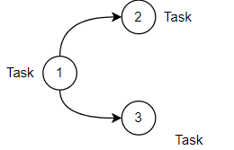
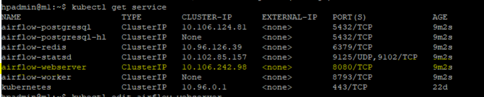

### DAG
1. Directed cyclic graph. It doesnot have any loop 
   -   


### Operators
1. There are three types of operators
    - Action
    - Transfer
    - Sensor


### Standard airflow installation using helm
1. [Add repo and install.](https://artifacthub.io/packages/helm/airflow-helm/airflow)
    - Add repo
        ```
        helm repo add apache-airflow https://airflow.apache.org
        ```
    -  Install Airflow
        ```
        helm install airflow apache-airflow/airflow --namespace airflow
        ```
### Customize the value.yaml and then  install airflow
1. Get the output of helm values for your reference.
    - 
    ```
    helm show values airflow-helm/airflow > values.yaml
    ```
2. In our case, we want to use the persistent volume to upload the dags.
    - Create PV and PVC for airflow when you dont have dynamic SC
    ```
    kubectl apply -f airflow-pv.yaml
    ```
    ```
    kubectl apply -f airflow-pvc.yaml
    ```
    - Pick the section which you want to update. create [value.yaml](value.yaml)
    - If you have dynamic df storage class just create PVC and pass the pvc name in the value.yaml
3. Install airflow by passing value.yaml file. Customize it 
    ```
     helm install airflow apache-airflow/airflow --values value.yaml
     ```
### Install custom airflow by passing parameter

1. If you want to set few parameters:
    ```
    helm install airflow apache-airflow/airflow --set web.username=admin,web.password=admin --debug
    ```
### Update the service to NodePort
update the service to NodePort so that we can access the airflow web UI at Physical host address.
1. Get the service name
    ```
    kubectl get service
    ```
2. Edit the web service
    ```
    kubectl edit service  airflow-webserver 
    ```
    -   
    - Update the type of service to NodePort.
      

6. Get the service port and navigate to the `http://<Ip address of node>:<Service port>`
    ```
    kubectl get service
    ```
    - Validate that the service type is now nodeport and the  service port is 30677
    

## Mounting dag with PVC
1. Identify the CSI name which is mapped to the PV of the airflow. In our case the pvc name is airflow-pvc. 
    - First we identify the pv name associated with PVC. 
    ```
    kubectl get pvc/airflow-pvc -o json | jq .spec.volumeName
    ```
    - Second we will map the csi name
    ```
    kubectl get pv/mapr-pv-53746007-2c9c-4953-b0b1-6b34abe7422b -o json | jq .spec.csi.volumeHandle
    ```
2. As we created DF as our CSI. Below is the path where we can keep our dags
    ```
    cd /mnt/mapr_nfs/df5node/csi/csi-pv-gpu.uavwasscdg
    ```
### Installation using docker

* Build a docker image from the Dockerfile in the current directory (airflow-materials/airflow-basic)  and name it airflow-basic
    -   Build docker image 
    ```
    docker build -t 10.10.162.143:9002/airflow-basic/v1:2.0.0 .
    ```
    - Run docker image
    ```
    docker run --rm -d -p 8888:8080 --mount type=bind,source=/mnt/mapr_nfs/df5node/data/airflow/dags,target=/opt/airflow/dags  10.10.162.143:9002/airflow-basic/v1:2.0.0
    ```

* For new user please just run the docker run command as the image has been already pushed to the private registry

* Navigate to the localhost:8080 to go to the interface of airflow
### Airflow CLI

1. check the image running
    ```
    docker ps
    ```

2. Execute the command /bin/bash in the container_id to get a shell session
    ```
        docker exec -it container_id /bin/bash
    ```

3.  Print the current path where you are
`pwd`

4. Initialise the metadatabase
    ```
    airflow db init
    ```

5. Reinitialize the metadatabase (Drop everything)
    ```
    airflow db reset
    ```
6. Upgrade the metadatabase (Latest schemas, values, ...)
    ```
    airflow db upgrade
    ```
7. Start Airflow’s webserver
    ```
    airflow webserver
    ```
8. Start Airflow’s scheduler
    ```
    airflow scheduler
    ```
9. Start a Celery worker (Useful in distributed mode to spread tasks among nodes - machines)
    ```
    airflow celery worker
    ``` 
10. Give the list of known dags (either those in the examples folder or in dags folder)

    ```
    airflow dags list
    ``` 

11. Trigger the dag example_python_operator with the current date as execution date
    ```
    airflow dags trigger example_python_operator
    ```
12.  Trigger the dag example_python_operator with a date in the past as execution date (This won’t trigger the tasks of that dag unless you set the option catchup=True in the DAG definition)
    ```
    airflow dags trigger example_python_operator -e 2021-01-01
    ```
13. Trigger the dag example_python_operator with a date in the future (change the date here with one having +2 minutes later than the current date displayed in the Airflow UI). The dag will be scheduled at that date.
    ```
    airflow dags trigger example_python_operator -e '2021-01-01 19:04:00+00:00'
    ```

14.  Display the history of example_python_operator’s dag runs.
```
airflow dags list-runs -d example_python_operator
```
15. List the tasks contained into the example_python_operator dag
    ```
    airflow tasks list example_python_operator
    ```

16. Allow to test a task (print_the_context) from a given dag (example_python_operator here) without taking care of dependencies and past runs. Useful for debugging.
    ```
    airflow tasks test example_python_operator print_the_context 2021-01-01
    ```

