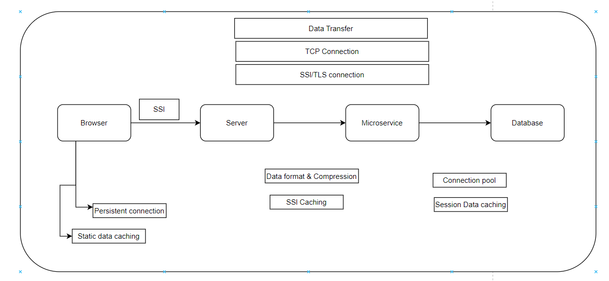
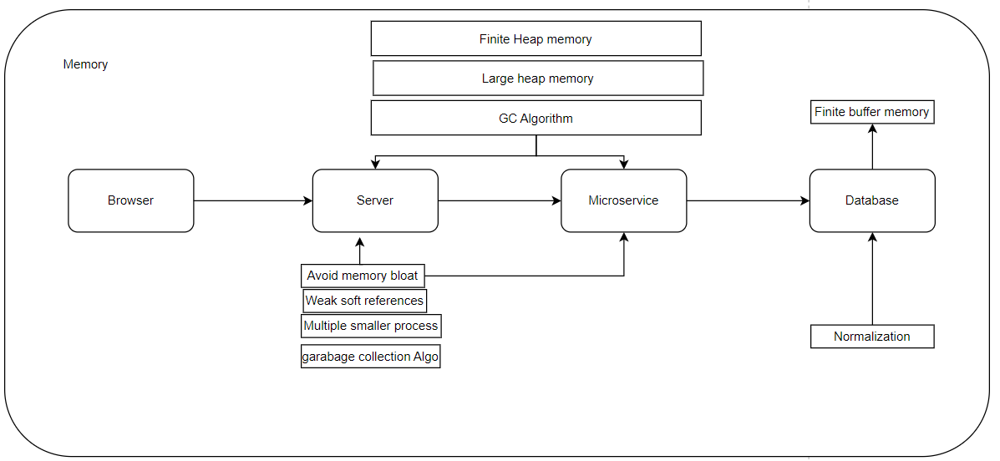
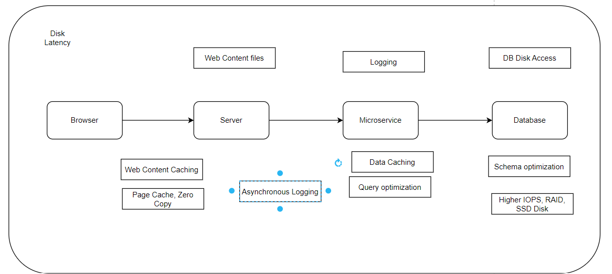

### Concepts
1. Perfomance
2. Scalability 
3. Reliability
4. Security
5. Deployment

### Perfomance
Measure of how fast or responsive a system is under give workload and give hardware. 

1. Efficiency
    1. Efficient resource utilization
        1. IO- Memory, Network, Disk
        2. CPU
    2. Efficient Logic
        1. Algorithm
        2. DB queries
    3. Data storage
        1. Data structures
        2. DB Schema
    4. Caching
2. Concurrency
    1. Hardware
    2. Software
        1. Queuing
        2. Coherence
2. Latency 
    1. CPU
    2. Memory
    3. Network
    4. Disk
2. Concurrency
    1. Locking
    2. Coherence
3. Caching
    1. Static data
    2. Dynamic data

#### Perfomance Metrics
1. Latency
    1. Network Latency
    
    2. Memory Latency
    
    3. Disk Latency
    
    4. CPU Latency
2. Throughput
3. Errors
4. Resource Saturations