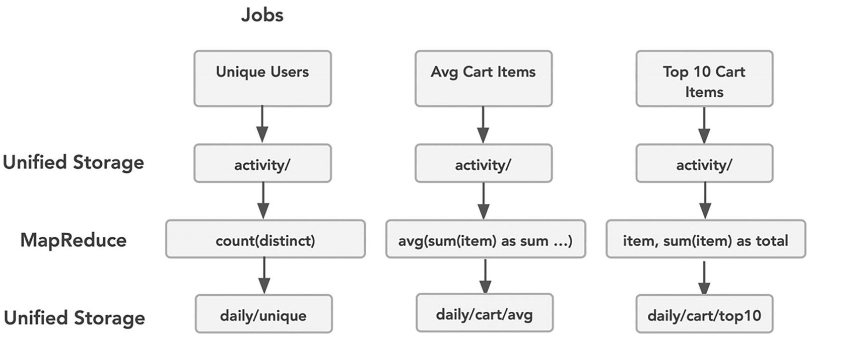
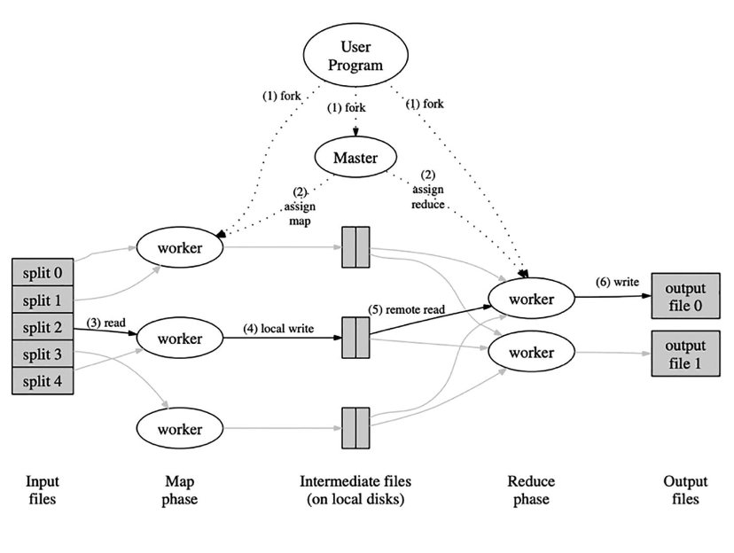
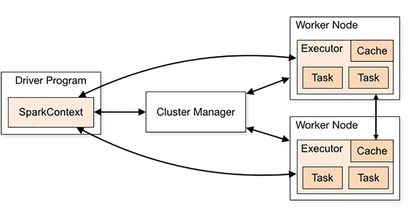
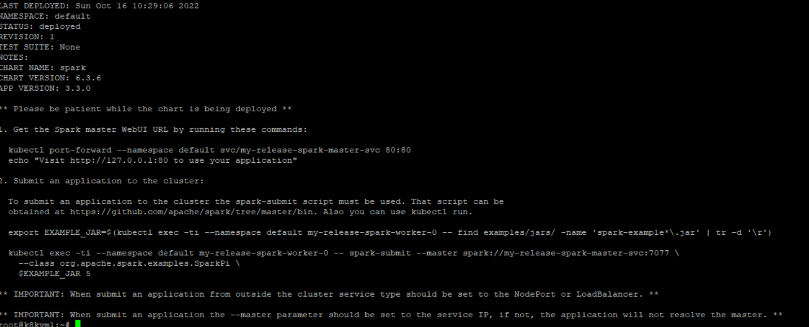
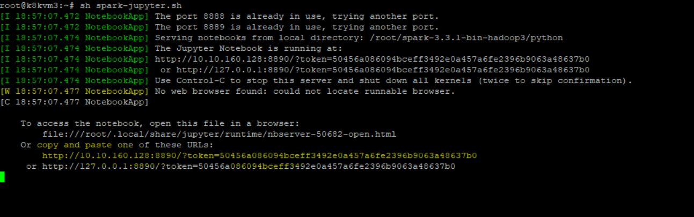

## Getting start with Spark
Apache Spark acts as the centralizing core component within the data platform. Much in the same way that the data warehouses and data lakes solved the central problem of common access to data, Spark solves the problem of both centralizing and unifying how data can be processed, at scale, across the entire data platform. 


### Spark Architecture
1. Distributed computing- In databricks, if we have 1 node with 4 cores then below is the stack we get
    - Each executor has 1 JVM per node. 1 node for driver which has 1 JVM
    - 1 Executor, 4 core/threads/slots, total 4 task can be run in parallel anytime. Also if there are 6 task then remaining 2 task will wait until slots are free.
    - 1 executor with 4 core can run 4 task 
2. Stages- 
### Apache Spark architecture
1. Mapreduce problem
    - 
    - 
2. Apache Spark changed the way data is loaded, transformed, and processed across parallel operations within the same application context (such as with our BI queries in Figure 2-2). It did so by introducing a flexible programming model that enabled engineers to write code locally that could be distributed when run within the cluster, that was incredibly fault-tolerant, and that could be written using a functional programming style. At the heart of the Spark programming model is the Resilient Distributed Dataset, or RDD.

3. There are three main components
    - 

### Working with data
1. Infer schema: By adding the optional configuration, you can now unleash the power of the Spark engine to infer (test and generate) schemas automatically. The resulting DataFrame (coffeeAndSchema) learned on its own that each row contained a String column and a Double column. The inference process will select the best possible match when reading semi-structured data like CSV or JSON.

    ```
    val coffeeAndSchema = spark.read
    .option("inferSchema", true)

    .csv("file:///learn/raw-coffee.txt")
    .toDF("name","roast")
    coffeeAndSchema.printSchema
    ```
2. Explicit schema:
In practice, data can change upstream in unexpected ways, so often it is in your best interest to use an explicit schema (declarative) when working with semi-structured data.
    ```
    # Define the schema
    coffeeSchema = StructType([
        StructField("name", StringType(), True),
        StructField("roast", DoubleType(), True)
    ])

    # Read the coffee CSV file using the defined schema
    coffees = spark.read \
        .option("inferSchema", "false") \
        .schema(coffeeSchema) \
        .csv("file:///learn/raw-coffee.txt")

    # Show the DataFrame
    coffees.show()
    ```

### Setup spark using Helm
1. Add the repo
    ```
    helm repo add bitnami https://charts.bitnami.com/bitnami
    ```

2. Install the spark release
    ```
    helm install my-release bitnami/spark
    ```
3. You will see the following commands as output


4. Execute below commands to get the status 
    ```
    helm status my-release
    ```
## Set up spark on windows
1. https://medium.com/analytics-vidhya/installing-and-using-pyspark-on-windows-machine-59c2d64af76e
2. Adding env variable to integrate with jupyter notebook
    ```
    PYSPARK_DRIVER_PYTHON=jupyter
    PYSPARK_DRIVER_PYTHON_OPTS=notebook
    ```
#### Alternate way
1. https://sparkbyexamples.com/pyspark/how-to-install-and-run-pyspark-on-windows/
2. Add the env variable where python is getting executed
    ```
    import sys
    import os
    os.environ['PYSPARK_PYTHON'] = sys.executable
    os.environ['PYSPARK_DRIVER_PYTHON'] = sys.executable
    ```
## Setup Spark on ubuntu
1. Install JDK
    ```
    sudo apt install default-jdk
    ```
2. Download the spark
    ```
    wget https://dlcdn.apache.org/spark/spark-3.4.0/spark-3.4.0-bin-hadoop3.tgz
    ```
3. Extract, move and create env variable
    ```
    sudo mv spark-3.4.0-bin-hadoop3 /opt/spark
    nano ~/.bashrc
    export SPARK_HOME=/opt/spark
    export PATH=$PATH:$SPARK_HOME/bin
    source ~/.bashrc
    ```
### Setup spark using jupyert notebook
1. [Jupyter notebook using pyspark](https://python.plainenglish.io/apache-spark-using-jupyter-in-linux-installation-and-setup-b2cacc6c7701)
2. ```
    sudo apt install python3-notebook jupyter jupyter-core python3-pip
    ```
2. Check jupyter notebook
    ```
    jupyter notebook
    ```
3.  ```
    sudo apt-get update
    ```
4. Install Java
    ```
     sudo apt-get install default-jre
     ```
5. Install Scala
    ```
    sudo apt-get install scala
    ```
6. Install py4j
    ```
    pip3 install py4j
    ```
7. Download the spark and hadoop
    ```
    wget https://dlcdn.apache.org/spark/spark-3.3.0/spark-3.3.0-bin-hadoop3.tgz
    ```

    ```
    sudo tar -zxvf spark-3.3.0-bin-hadoop3.tgz
    ```
8. Set the env variable
    ```
    export SPARK_HOME='/root/spark-3.3.0-bin-hadoop3'
    export PATH=$SPARK_HOME:$PATH
    export PYTHONPATH=$SPARK_HOME/python:$PYTHONPATH
    export PYSPARK_DRIVER_PYTHON="jupyter"
    export PYSPARK_DRIVER_PYTHON_OPTS="notebook"
    export PYSPARK_PYTHON=python3
    ```
9. give permission to spark folder and open the jupyter notebook
    ```
    sudo chmod 777 spark-3.3.0-bin-hadoop3
    ```
    ```
    
    cd spark-3.3.0-bin-hadoop3/
    sudo chmod 777 python
    cd python
    chmod 777 pyspark
    jupyter notebook
    ```

### Setup Delta lake on Spark
1. Install delta pyspark module
    ```
    pip install delta-spark 
    ```
2.  Navigate to the spark directory
    ```
    cd /opt/spark/python/
    ```
3. Run 
   ```
   jupyter notebook
   ```
4. Execute below command
    ```
    from delta import *
    import pyspark

    builder = pyspark.sql.SparkSession.builder.appName("MyApp") \
    .config("spark.sql.extensions", "io.delta.sql.DeltaSparkSessionExtension") \
    .config("spark.sql.catalog.spark_catalog", "org.apache.spark.sql.delta.catalog.DeltaCatalog")

    spark = spark = configure_spark_with_delta_pip(builder).getOrCreate()
    ```

### Open the jupyter notebook backed by spark and delta spark

1. Navigate to following
    ```
    ip address: 10.10.160.128
    username: hpadmin
    password: HP1nvent!
    ```
2. Switch to root user
    ```
    sudo -i
    ```
3. Execute the bash file
    ```
    sh spark-jupyter.sh
    ```
4. Copy the endpoint of jupyter notebook highlighted below

      
5. Check the jupyter notebook endpoint if it has been already created
    ```
    jupyter notebook list
    ```


## Setup spark on kubernetes
1. Setup using helm
    ```
    helm repo add bitnami https://charts.bitnami.com/bitnami
    helm install my-release bitnami/spark --set worker.replicaCount=5
    ```
2. 