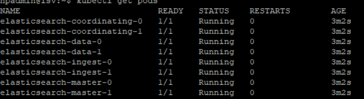

## Install elasticsearch
1. Install elasticsearch using helm
    ```
    helm install elasticsearch --set master.replicas=3,coordinating.service.type=LoadBalancer bitnami/elasticsearch
    ```
2. Monitor the deployment
    ```
    kubectl get pods
    ```
    
3. Forward the service to the port 9200. Execute the below command in the tmux window
    ```
    tmux
    ```
    
    ```
    kubectl port-forward --namespace default svc/elasticsearch 9200:9200
    ```
    - Enter  
    `ctr + b`
    and press `d`
4. 