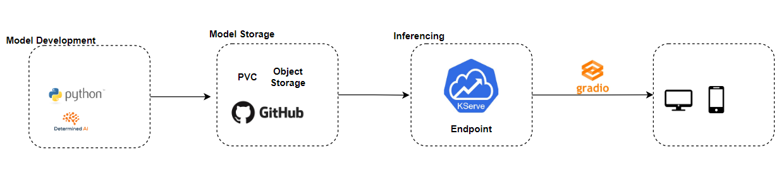
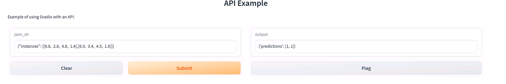

### Setup
1. Prerequiste: K8 >= 1.22

2. Install the KServe "Quickstart" environment
    ```
    curl -s "https://raw.githubusercontent.com/kserve/kserve/release-0.10/hack/quick_install.sh" | bash
   
    ```
### Create Ineference Service


1. [Run first inference service](https://kserve.github.io/website/0.10/get_started/first_isvc/)
    - For Kserve>0.8
    - Create namespace
    ```
    kubectl create namespace kserve-test
    ```
    - Create an InferenceService
        ```
        kubectl apply -n kserve-test -f - <<EOF
        apiVersion: "serving.kserve.io/v1beta1"
        kind: "InferenceService"
        metadata:
        name: "sklearn-iris"
        spec:
        predictor:
            model:
            modelFormat:
                name: sklearn
            storageUri: "gs://kfserving-examples/models/sklearn/1.0/model"
        EOF
        ```
    - Check the inference service
        ```
        kubectl get inferenceservices sklearn-iris -n kserve-test
        ```
    - Determine the ingress IP and ports
        ```
        export INGRESS_HOST=$(kubectl -n istio-system get service istio-ingressgateway -o jsonpath='{.status.loadBalancer.ingress[0].ip}')
        export INGRESS_PORT=$(kubectl -n istio-system get service istio-ingressgateway -o jsonpath='{.spec.ports[?(@.name=="http2")].port}')
        ```
    - Prepare input
        ```
        cat <<EOF > "./iris-input.json"
        {
        "instances": [
            [6.8,  2.8,  4.8,  1.4],
            [6.0,  3.4,  4.5,  1.6]
        ]
        }
        EOF
        ```
    - Curl the inference
        ```
        SERVICE_HOSTNAME=$(kubectl get inferenceservice sklearn-iris -n kserve-test -o jsonpath='{.status.url}' | cut -d "/" -f 3)
        curl -v -H "Host: ${SERVICE_HOSTNAME}" "http://${INGRESS_HOST}:${INGRESS_PORT}/v1/models/sklearn-iris:predict" -d @./iris-input.json
        ```

### Expose the Inference Endpoint using Gradio


1. Create webapp using gradio
    ```
    import json
    import gradio as gr
    import requests

    def api_predict(json_str):
        url = "http://10.10.162.187:80/v1/models/sklearn-iris:predict"
        data_dict = json.loads(json_str)
        # Add the 'Host' header to the request headers
        headers = {"Host": "sklearn-iris.kserve-test.example.com"}
        # Send the POST request with the headers and payload
        response = requests.post(url, headers=headers, json=data_dict)
        # Process the response
        if response.status_code == 200:
            output=response.json()
        else:
            print("Error:", response.status_code)
        return output
    # create a Gradio interface
    interface = gr.Interface(
        fn=api_predict,
        inputs=gr.inputs.Textbox(),
        outputs=gr.outputs.Textbox(),
        title="API Example",
        description="Example of using Gradio with an API."
    )

    # launch the interface
    interface.launch()

    ```
2. Once the app is launch, pass the below input
    ```
    {"instances": [[6.8,  2.8,  4.8,  1.4],[6.0,  3.4,  4.5,  1.6]]}
    ```
3. You will get the following output
    ```
    
    ```