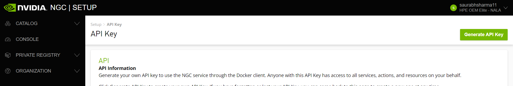
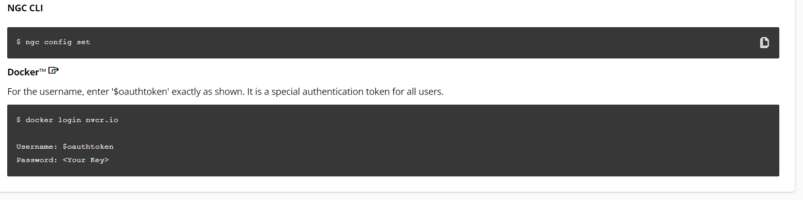

1. login to the NGC catalog
    - https://catalog.ngc.nvidia.com/enterprise
    - username/password- saurabh.sharma@hpe.com/HP1nvent!


2. Configure NGC CLI and docker authentication.  
    -  Generate the api key and enter the API key
            x
    - API key: Z3MyZDAwczhoYzcyNjFrOWlqaWJpdW5kYnU6MjY5Y2QwMjctZjkzNi00M2I3LTg0NmEtZmUyMjdmNDhkNzNi
    - [Setup the ngc](https://ngc.nvidia.com/setup/installers/cli)
        ```
        wget --content-disposition https://ngc.nvidia.com/downloads/ngccli_linux.zip && unzip ngccli_linux.zip && chmod u+x ngc-cli/ngc
        find ngc-cli/ -type f -exec md5sum {} + | LC_ALL=C sort | md5sum -c ngc-cli.md5
        echo "export PATH=\"\$PATH:$(pwd)/ngc-cli\"" >> ~/.bash_profile && source ~/.bash_profile
        ngc config set
        ```
    - Below is the command we ran to setup ngc and docker
        


### [ASR using RIVA](https://catalog.ngc.nvidia.com/orgs/nvidia/teams/riva/resources/riva_quickstart)
1. [Local Deployment using Start Script](https://docs.nvidia.com/deeplearning/riva/user-guide/docs/quick-start-guide.html#local-deployment-using-quick-start-scripts)
    - Download the script
        ```
        ngc registry resource download-version nvidia/riva/riva_quickstart:2.13.0
        ```
2. Initialize and start Riva.
    ```
    cd riva_quickstart_arm64_v2.13.0
    bash riva_init.sh
    bash riva_start.sh
    ```


### Run Models 

### Run Helm chart

  