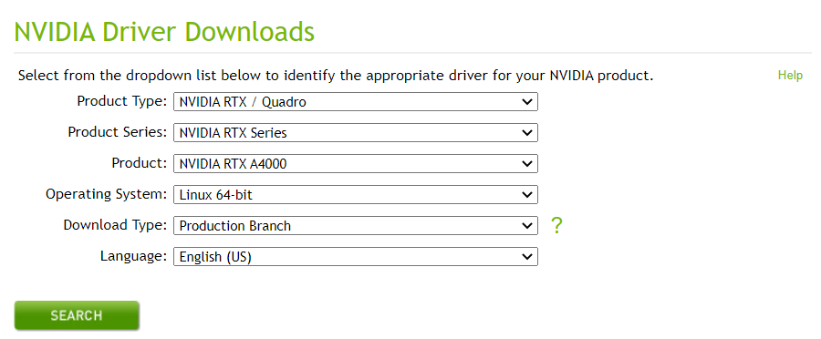
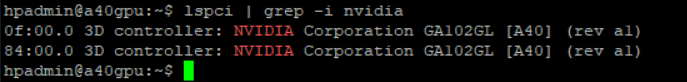
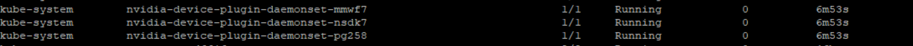

### Installation
0. Install Docker
    ```
    curl -fsSL https://get.docker.com -o get-docker.sh
    sudo sh ./get-docker.sh --dry-run
    ```
1. [NVIDIA drivers](#setup-the-nvidia-driver)

2. [NVIDIA Container Toolkit](#setup-the-nvidia-container-toolkit)

3. Optional [NVIDIA GPU operator](#install-nvidia-gpu-operator)

4. Set up the ngc cli
### Setup the NVIDIA driver

1. [Navigate to the NVIDIA driver](https://www.nvidia.com/Download/index.aspx?lang=en-us) and provide the details of your NVIDIA product
     
    To run the driver for GPU A40 link
    ```
    https://us.download.nvidia.com/tesla/460.106.00/NVIDIA-Linux-x86_64-460.106.00.run
    ```
    - run the binary
    ```
    sudo bash NVIDIA-Linux-x86_64-535.86.10.run
    ```
2. Install the package managers
    ```
    sudo apt-get install linux-headers-$(uname -r)
    distribution=$(. /etc/os-release;echo $ID$VERSION_ID | sed -e 's/\.//g')
    wget https://developer.download.nvidia.com/compute/cuda/repos/$distribution/x86_64/cuda-keyring_1.0-1_all.deb
    sudo dpkg -i cuda-keyring_1.0-1_all.deb
    sudo apt-get update
    sudo apt-get -y install cuda-drivers
    ```
3. [Setup the env variables](https://docs.nvidia.com/cuda/cuda-installation-guide-linux/index.html#recommended-actions)
    ```
    export PATH=/usr/local/cuda-12.2/bin${PATH:+:${PATH}}
    
    ```
4. Verify the driver version
    ```
    cat /proc/driver/nvidia/version
    ```

### Setup the NVIDIA container toolkit
1. [Install the container toolkit](https://docs.nvidia.com/datacenter/cloud-native/container-toolkit/latest/install-guide.html#step-1-install-nvidia-container-toolkit)
    - Install package repo and GPG key
        ```
        distribution=$(. /etc/os-release;echo $ID$VERSION_ID) \
      && curl -fsSL https://nvidia.github.io/libnvidia-container/gpgkey | sudo gpg --dearmor -o /usr/share/keyrings/nvidia-container-toolkit-keyring.gpg \
      && curl -s -L https://nvidia.github.io/libnvidia-container/$distribution/libnvidia-container.list | \
            sed 's#deb https://#deb [signed-by=/usr/share/keyrings/nvidia-container-toolkit-keyring.gpg] https://#g' | \
            sudo tee /etc/apt/sources.list.d/nvidia-container-toolkit.list
        ```
    - Install the nvidia-container-toolkit package (and dependencies) after updating the package listing:
    
        ```
        sudo apt-get update
        sudo apt-get install -y nvidia-container-toolkit-base
        sudo apt-get install -y nvidia-docker2
        ```
    - Configure the docker daemon
        ```
        sudo nvidia-ctk runtime configure --runtime=docker
        sudo systemctl restart docker
        ```
    - Test the container 
        ```
        sudo docker run --rm --runtime=nvidia --gpus all nvidia/cuda:11.6.2-base-ubuntu20.04 nvidia-smi
        ```
### Inference of large language models.

1. [Create mew conda env](https://github.hpe.com/hpe/na-ai-lab-determined#install-miniconda)
2. [Run Falcon model](https://github.com/titanml/takeoff#-usage)
    - Install library
        ```
        pip install titan-iris
        ```
    - Launch inference server
        ```
        iris takeoff --model tiiuae/falcon-7b-instruct --device cuda --port 8000
        ```

### [Kubernetes with GPU](https://docs.nvidia.com/datacenter/cloud-native/kubernetes/install-k8s.html)
### Prerequiste
1. [On-prem Kubernetes installed](https://github.hpe.com/hpe/na-ai-lab-aas/tree/main/kubernetes/kubeadm)
1. Verify the system has a CUDA-capable GPU

2. Verify the system is running a supported version of Linux
    ```
    uname -m && cat /etc/*release
    ```
    The x86_64 line indicates you are running on a 64-bit system
3. Verify the system has build tools such as make, gcc installed
    ```
    gcc --version
    ```
4. [Verify the system has correct Linux kernel headers](https://docs.nvidia.com/deeplearning/cudnn/support-matrix/index.html)

### [Install NVIDIA GPU operator]( https://docs.nvidia.com/datacenter/cloud-native/gpu-operator/latest/getting-started.html#namespace)
1. Setup the helm repo add for nvidia
    ```
    helm repo add nvidia https://helm.ngc.nvidia.com/nvidia \
   && helm repo update
   ```
2. Set up the gpu operator
    ```
    helm install --wait --generate-name \
     -n gpu-operator --create-namespace \
     nvidia/gpu-operator
     ``````
3. [Run simple application of pods](https://docs.nvidia.com/datacenter/cloud-native/gpu-operator/latest/getting-started.html#running-sample-gpu-applications)

### Optional-Install NVIDIA Device Plugin
1. [Enable GPU support](https://github.com/NVIDIA/k8s-device-plugin#enabling-gpu-support-in-kubernetes)
    ```
     kubectl create -f https://raw.githubusercontent.com/NVIDIA/k8s-device-plugin/v0.12.3/nvidia-device-plugin.yml
    ```
    - if we have three untaint node then below daemon set pods will be created
      
2. Execute
    ```
    cat <<EOF | kubectl apply -f -
    apiVersion: v1
    kind: Pod
    metadata:
    name: gpu-pod
    spec:
    restartPolicy: Never
    containers:
        - name: cuda-container
        image: nvcr.io/nvidia/k8s/cuda-sample:vectoradd-cuda10.2
        resources:
            limits:
            nvidia.com/gpu: 1 # requesting 1 GPU
    tolerations:
    - key: nvidia.com/gpu
        operator: Exists
        effect: NoSchedule
    EOF
    ```
3. Check the status
    ```
    kubectl logs gpu-pod
    ```


## Setup NGC CLI
1. [Linux Install](https://ngc.nvidia.com/setup/installers/cli)
2. Download the zip
    ```
    wget --content-disposition https://ngc.nvidia.com/downloads/ngccli_linux.zip && unzip ngccli_linux.zip && chmod u+x ngc-cli/ngc
    ```
3.  Add the directory to the path
    ````
    echo "export PATH=\"\$PATH:$(pwd)/ngc-cli\"" >> ~/.bash_profile && source ~/.bash_profile
    ```
4. Enter the API key
    ```
    ngc config set
    ```