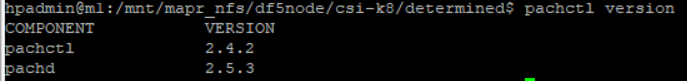
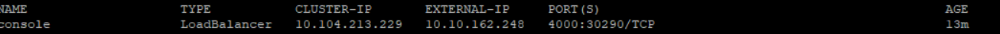

## Installation of pachyderm on k8 1.22 using local storage
1. Installation metallb loadbalancer using manifest file
    - manifets file
    ```
    kubectl apply -f https://raw.githubusercontent.com/metallb/metallb/v0.13.9/config/manifests/metallb-native.yaml
    ```
2. In order to assign an IP to the services, MetalLB must be instructed to do so via the IPAddressPool CR. Assign  the range of IP addresses in the [pool yaml file.](metallb_ip_pool.yaml)
    ```
    kubectl apply -f metallb_ip_pool.yaml
    ```
3. In order to advertise the IP coming from an IPAddressPool, an L2Advertisement instance must be associated to the IPAddressPool.[manifest file](metallb_ip_advertisement.yaml)
    ```
    kubectl apply -f metallb_ip_advertisement.yaml
    ```
4. Create the values yaml for pachyderm
    - [my_pachyderm_values.yaml](my_pachyderm_values.yaml)

3. Create the storage class and the manually create the persistent volume as host storage type doesnot support dynamic PVC>
    1. Create storage class manifest [file](sc.yaml)
        ```
        kubectl apply -f sc.yaml
        ```
    2. Make it a default storage class
        ```
        kubectl patch storageclass manual -p '{"metadata": {"annotations":{"storageclass.kubernetes.io/is-default-class":"true"}}}'
        ```
    3. Create 3 persistent volume. Manifest file for [pv](pv.yaml)
        ```
        kubectl apply -f pv.yaml
        ```

4. Install pachyderm using helm
    - [Install Helm](https://github.hpe.com/cyrill-hug/Documentation_PDS_Local_EDF#step-6-installing-determinedai)
    - Download the client tool of pachyderm
        ```
        curl -o /tmp/pachctl.deb -L https://github.com/pachyderm/pachyderm/releases/download/v2.4.2/pachctl_2.4.2_amd64.deb && sudo dpkg -i /tmp/pachctl.deb  
        ```
        - Check the version of pachyderm client
            ```
            pachctl version --client-only  
            ```
    - Add the pachyderm repo
        ```
        helm repo add pach https://helm.pachyderm.com
        helm repo update
        ```
    
    - Install pachyderm
        
        ```
        helm install pachd -f my_pachyderm_values.yaml pach/pachyderm
        ```
5. Get the loadbalancer endpoint and port address
    ```
    kubectl get services | grep pachd-lb | awk '{print $4}'
    ```
6. Set the context
    ```
    echo '{"pachd_address":"grpc://<pachyderm loadbalance service>:30650"}' | pachctl config set context pachd --overwrite && pachctl config set active-context pachd

    ```
7. Validate the version
    ```
    pachctl version
    ```
    
8. Navigate to the pachyderm console and access the pachyderm
    

9. [To install pachyderm with DF as CSI](https://github.hpe.com/cyrill-hug/Documentation_PDS_Local_EDF)